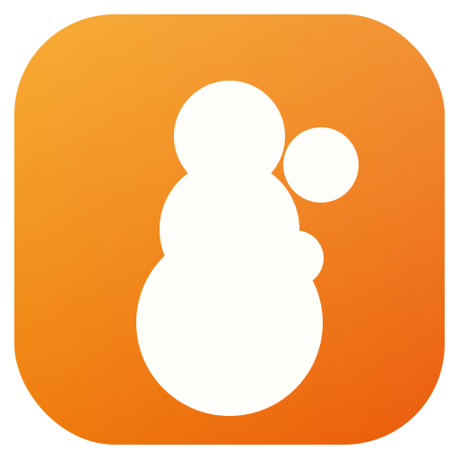

<p align="center">
  
</p>

<h1 align="center">Fragilume — Note Studio for Author or Interest</h1>

<p align="center">
  <em>Studio catatan untuk penulis novel, komik, film &amp; game.</em><br/>
  <em>A note studio for novel, comic, film &amp; game writers.</em>
</p>

<p align="center">
  
  
  
  
  
  
  
</p>

---

> **Catatan / Note:** The app UI is in **Bahasa Indonesia** (e.g. "Edit Buku", "Plot", "World Building", "Wiki", "Tersimpan lokal"). README ini ditulis dalam Bahasa Inggris agar mudah dibaca oleh siapa saja; istilah UI Indonesia tetap dipertahankan dalam tanda kutip. This README is written primarily in English; Indonesian UI labels are kept in quotes where helpful.

## Tentang / About

Fragilume is a lightweight note-taking app built with the help of GLM-5.1, made for people who think in bursts of imagination and need a fast way to capture them — as well as for authors who want a simple place to record story ideas and concepts. It started as a playful side project, but I hope it turns out useful for serious writing too.

It gives you a single, private workspace to plan your **Plot** (act → chapter → scene → beat → note), build your **World** (location, culture, history, magic, tech, religion, geography, lore), and catalogue your **Wiki** (character, item, faction, location, event, concept) — all stored locally on your own machine, with no account and no cloud.

## Fitur / Features

- 🪶 **First-run onboarding** — set your *nama pena* (pen name). Multi-profile: each profile is a separate, isolated bookshelf.
- 🗂️ **Dashboard** — book CRUD with covers, search, type filter (Novel / Komik / Film / Game / Lainnya), status, genre, and accent color.
- ✍️ **Edit Buku** with three master-detail editors:
  - **Plot** — kind: `act` · `chapter` · `scene` · `beat` · `note`
  - **World Building** — category: `location` · `culture` · `history` · `magic` · `tech` · `religion` · `geography` · `lore`
  - **Wiki** — category: `character` · `item` · `faction` · `location` · `event` · `concept`
- 💾 **Debounced autosave** (700ms) on every detail editor — type freely, it persists as you pause.
- 🪟 **Floating glass sidebar** on desktop + **mobile slide-out drawer** with a top navbar (hamburger + settings gear).
- ⚙️ **Settings**:
  - **Profiles** — full CRUD; switch active profile to change the bookshelf.
  - **Theme** — Terang / Gelap / Sistem (light / dark / system) via `next-themes`.
  - **Accent color** customization.
  - **Backup &amp; Restore** — export/import a single `.json` file; defaults to the OS **Documents** folder via the File System Access API (with a download fallback).
- 📊 **Status bar** — shows app version, active profile, current view, and a "Tersimpan lokal" indicator.
- 🌗 **Light / Dark / System** theme out of the box.

## Screenshots

> Screenshots live in `./docs/screenshots/`. Uncomment the markdown lines once you add the PNG files.

<!--  -->
<!--  -->
<!--  -->
<!--  -->
<!--  -->

## Tech Stack

| Layer            | Choice                                   |
| ---------------- | ---------------------------------------- |
| Framework        | Next.js 16 (App Router)                  |
| Language         | TypeScript 5                             |
| Styling          | Tailwind CSS 4                           |
| UI components    | shadcn/ui (New York) + Lucide icons      |
| Database         | Prisma ORM (SQLite)                      |
| Client state     | Zustand                                  |
| Server state     | TanStack Query                           |
| Theme            | next-themes                              |
| Animation        | Framer Motion                            |
| Date             | date-fns (`id` locale)                   |
| Icons            | lucide-react                             |
| Runtime          | Bun (dev) / Node.js (production)         |

## Getting Started

### Prerequisites

- **Node.js 20+**
- **Bun** (recommended) or **npm**

### Install &amp; run

```bash
# 1. Install dependencies
bun install

# 2. Push the Prisma schema to the local SQLite DB
bun run db:push

# 3. Start the dev server
bun run dev
# → http://localhost:3000
```

### Other scripts

```bash
bun run lint          # ESLint
bun run db:generate   # Regenerate Prisma client
bun run db:reset      # Reset the DB (destroys data)
bun run build         # Production build (outputs .next/standalone)
```

## Project Structure

```
fragilume/
├─ prisma/
│  └─ schema.prisma            # Profile · Book · PlotNode · WorldEntry · WikiEntry
├─ public/                     # Static assets (logo, mark, robots.txt)
├─ electron/                   # Desktop packaging scaffold (see BUILD.md)
│  ├─ main.cjs
│  └─ preload.cjs
├─ electron-builder.yml        # electron-builder config (.exe / .AppImage / .dmg)
├─ src/
│  ├─ app/                     # Next.js App Router — page.tsx + /api/* routes
│  ├─ components/
│  │  ├─ app/                  # App-level UI (dashboard, editors, nav-rail, settings…)
│  │  └─ ui/                   # shadcn/ui (New York)
│  └─ lib/                     # brand, domain, store, db, backup, utils, types
├─ db/                         # SQLite database file (dev.db) — created on db:push
├─ package.json
├─ README.md
└─ BUILD.md                    # Packaging guide (desktop + mobile)
```

## Data &amp; Privacy

- **All data is stored locally** in a SQLite file at `db/dev.db` (or `app.getPath('userData')` in a packaged desktop build — see `BUILD.md`).
- **No cloud, no telemetry, no account.** The app has no network calls except the local Next.js API routes.
- **Backup &amp; Restore** is built in — open **Settings → Backup &amp; Restore** to export a single `.json` snapshot of every profile, book, and entry. Import the same file on any machine to restore.

## Packaging

Fragilume ships as a desktop app via **Electron + electron-builder** (Windows `.exe`, Linux `.AppImage`, macOS `.dmg`), with an optional **Capacitor** path for an Android `.apk`. Full step-by-step instructions, including the SQLite/Prisma engine caveats and the honest architectural note on the `.apk` route, live in:

👉 **[./BUILD.md](./BUILD.md)**

## Roadmap

- [x] Multi-profile bookshelf
- [x] Plot / World Building / Wiki editors with autosave
- [x] Backup &amp; Restore (.json)
- [x] Dark / Light / System theme
- [ ] Desktop packaging: `.exe` / `.AppImage` / `.dmg` (scaffold in `BUILD.md`)
- [ ] Mobile `.apk` — **requires a storage refactor** (server-side Prisma → client-side SQLite / IndexedDB). See the honest note in `BUILD.md`.
- [ ] Rich-text editor for long-form content
- [ ] Drag-and-drop reordering for plot nodes

## Contributing

This is a portfolio project, but pull requests are welcome.

1. Fork the repo
2. Create your branch: `git checkout -b feat/my-feature`
3. Commit your changes with clear messages
4. Open a Pull Request

Please run `bun run lint` before submitting.

## License

This project is licensed under the **GNU General Public License v3.0** — see [LICENSE](./LICENSE) for the full text.

In short: you're free to use, study, and modify this code, but any distributed derivative work (including a modified or rebranded version) must also be released as source-available under the same GPLv3 license.

## Credits

Built by **Muhammad Syawal Ashar (M. S. Ashar)** as a portfolio project, with the help of GLM-5.1. UI labels are in Bahasa Indonesia by design — terima kasih sudah mampir. ✨